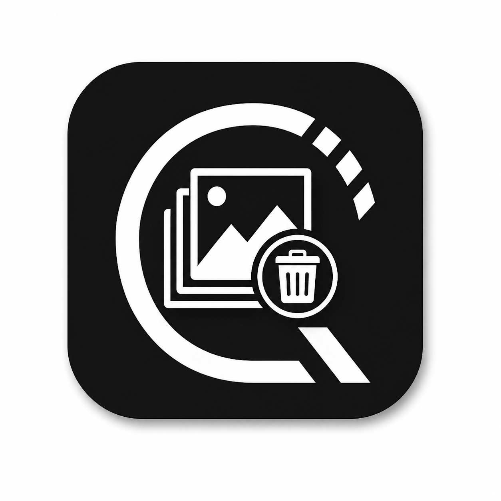
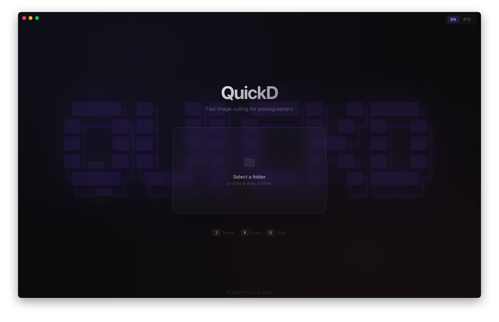

<div align="center">
  
  <h1>QuickD</h1>
  <p>Fast, keyboard-driven photo culling for photographers — built for speed, not clicks.</p>

  
  
  
  
</div>

---

## Overview

QuickD lets you blaze through a folder of JPEGs and decide — keep or delete — using only your keyboard. No clicking through menus, no waiting for bloated software to load.

<!-- Screenshot: Welcome screen / home page -->


---

## Features

- **Keyboard-first** — `J` to mark delete, `K` to keep, `H`/`L` to navigate, `U` to undo
- **Non-destructive** — files are moved to Trash, never permanently deleted without confirmation
- **Sliding preload** — images ahead and behind are preloaded for instant flipping
- **Review before delete** — summary screen shows every file queued for deletion before anything is trashed
- **Drag & drop** — drop a folder onto the app to start immediately
- **Bilingual** — English and 中文 supported

---

## Screenshots

<table>
  <tr>
    <td align="center">
      <!-- Screenshot: Welcome / folder select screen -->
      
      <br/><sub><b>Welcome Screen</b></sub>
    </td>
    <td align="center">
      <!-- Screenshot: Culling screen with image -->
      
      <br/><sub><b>Culling Screen</b></sub>
    </td>
  </tr>
  <tr>
    <td align="center">
      <!-- Screenshot: Summary / review screen -->
      
      <br/><sub><b>Review & Delete</b></sub>
    </td>
    <td align="center">
      <!-- Screenshot: All done screen -->
      
      <br/><sub><b>Session Complete</b></sub>
    </td>
  </tr>
</table>

---

## Download

Go to the [Releases](https://github.com/stevezzh819/PhotoCullingSystem/releases) page and download the right file for your Mac:

| Mac | File |
|-----|------|
| Apple Silicon (M1/M2/M3/M4) | `QuickD-x.x.x-arm64.dmg` |
| Intel | `QuickD-x.x.x.dmg` |

> **First launch:** macOS may show a security warning since the app is not notarized. Right-click the app → **Open** to bypass Gatekeeper. Subsequent launches are normal.

---

## Keyboard Shortcuts

| Key | Action |
|-----|--------|
| `J` / `←` | Mark for deletion |
| `K` / `→` | Keep |
| `H` | Previous image |
| `L` | Next image |
| `U` | Undo last decision |
| `Esc` | Return to home screen |

---

## Tech Stack

- [Electron](https://www.electronjs.org/) — desktop shell
- [React](https://react.dev/) — UI
- [Framer Motion](https://www.framer.com/motion/) — animations
- [electron-vite](https://electron-vite.org/) — build tooling

---

## Build from Source

```bash
# Clone
git clone https://github.com/stevezzh819/PhotoCullingSystem.git
cd PhotoCullingSystem

# Install dependencies
npm install

# Run in development
npm run dev

# Build distributable
npm run dist
```

**Requirements:** Node.js 18+, macOS (for building `.dmg`)

---

## License

MIT © [VIART PTE. LTD.](https://github.com/stevezzh819)
